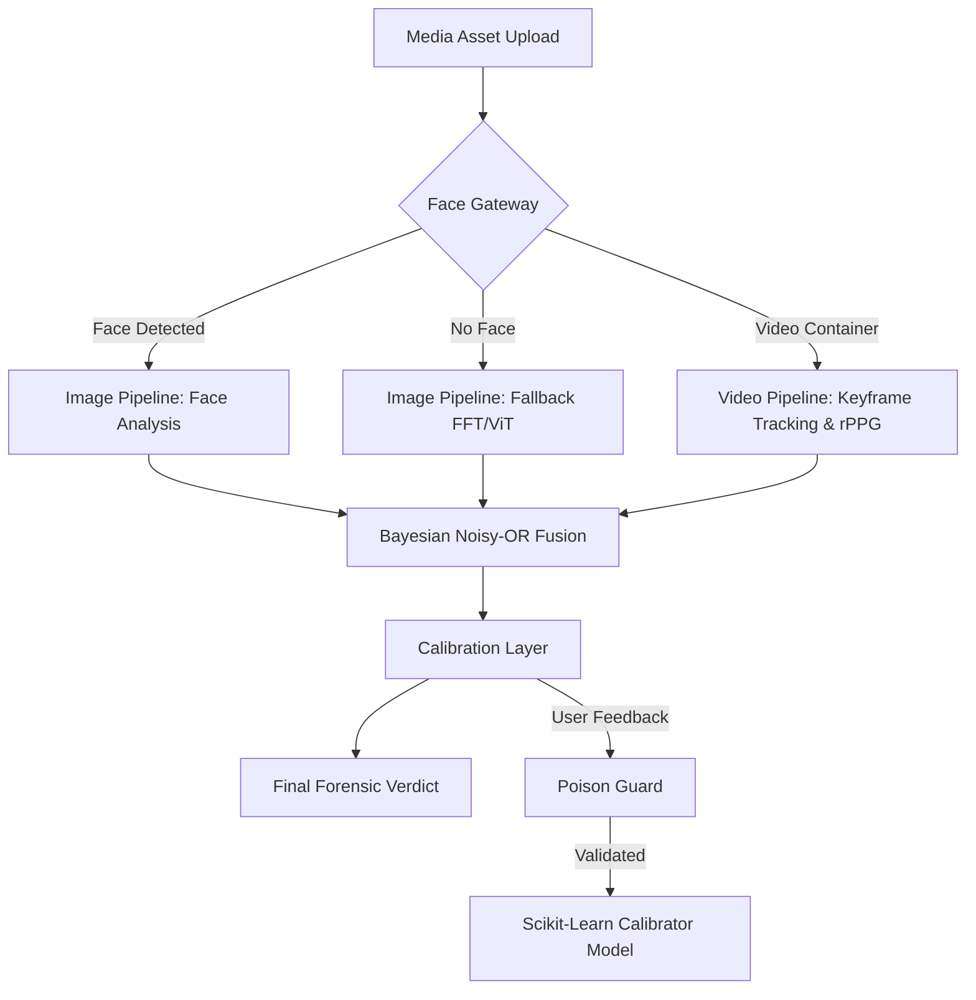

# Axiom-I: Physics-Guided Deepfake Image and Video Forensics Platform

[](LICENSE)
[](https://www.python.org)
[](https://nextjs.org)
[](https://fastapi.tiangolo.com)
[](https://github.com/Adarsh-61/Axiom-I)

Axiom-I is a complete, professional, and explainable media forensics platform engineered for deepfake detection, synthetic image inspection, and video manipulation analysis. By combining physics-informed computer vision algorithms, physiological pulse extraction, temporal anomaly analysis, and probabilistic Bayesian fusion, Axiom-I offers a robust and local-first solution for media verification.

### Official Project Links
* **GitHub Repository**: https://github.com/Adarsh-61/Axiom-I
* **Frontend Production**: https://axiom-i.vercel.app/
* **Alternative Production Domain**: https://axiom.dpdns.org/
* **Backend Production**: https://huggingface.co/spaces/Adarsh-61/axiom-backend

---

## 1. Project Overview

Generative AI models and deepfake software have progressed to a point where synthetic media can easily bypass human observation. Traditional deep learning approaches to detection are often treated as black boxes and are prone to overfitting on dataset-specific compression profiles. Axiom-I addresses these issues by grounding its forensic analysis in physical constraints (such as 3D illumination consistency) and biological markers (such as remote photoplethysmography). The system operates on a client-server microservices model, designed to process media locally to preserve user data privacy.

---

## 2. Key Features

* **Bifurcated Image Pipeline**: Supports full physics-based face analysis and a fallback analysis path for images without faces.
* **Temporal Video Pipeline**: Ingests video containers, samples keyframes adaptively, and extracts temporal anomalies across frames.
* **3D Illumination Consistency**: Computes 3D surface normals and fits a 9-term spherical harmonics basis to detect lighting discrepancies.
* **Specular Residual Homology**: Extracts specular highlights using Lambertian subtraction and calculates topological complexity.
* **Remote Photoplethysmography (rPPG)**: Extracts cardiac pulse waves from facial skin regions to verify physiological presence.
* **Probabilistic Bayesian Fusion**: Fuses multiple independent anomaly scores using a Noisy-OR Bayesian network.
* **Feedback and Online Calibration**: Blends physics-guided heuristic scores with a learned classifier model using user-submitted feedback.
* **Anti-Tampering Poison Guard**: Evaluates incoming telemetry feedback against seed distributions to block adversarial data poisoning.

---

## 3. Architecture Overview

Axiom-I is structured as a decoupled microservices architecture comprising two primary components:
1. **Frontend Presentation Layer**: A Next.js web application built with TypeScript and Vanilla CSS. It provides a visual media upload interface, a pipeline visualization graph showing step-by-step calculations, and a mathematics page using KaTeX rendering.
2. **Backend Forensic Engine**: A FastAPI Python service that runs OpenCV, NumPy, PyWavelets, and PyTorch for feature extraction and model inference.

### System Components Flowchart



### Ingestion Flow
* **Face Gateway**: Standardizes input dimensions and detects faces. If a face is found, the system runs local physical forensics. If no face is found, the system switches to fallback mode.
* **Microservices Link**: The frontend handles asset ingestion and forwards requests to the FastAPI backend, which handles feature extraction, model inference, and calibration database management.

---

## 4. Technology Stack

### Backend Forensic Engine
* **Language & Runtime**: Python 3.10 / 3.11
* **Web Framework**: FastAPI (Uvicorn server)
* **Numerical Libraries**: NumPy, SciPy (Welch PSD, signal filters)
* **Computer Vision**: OpenCV (headless runtime)
* **Signal Processing**: PyWavelets (discrete wavelet transform maps)
* **Deep Learning**: PyTorch, Transformers (Hugging Face Hub inference wrappers)
* **Machine Learning**: Scikit-Learn (calibrator classifiers: HistGradientBoosting, RandomForest)
* **Rate Limiting**: Slowapi (limiter configurations)

### Frontend Presentation Layer
* **Framework**: Next.js 14 / 16 (App Router)
* **Language**: TypeScript
* **Styling**: Vanilla CSS (CSS variables, responsive flex grids)
* **Mathematical Rendering**: KaTeX

---

## 5. Folder Structure

```
Axiom-I/
  Coding/
    backend/
      app/
        api/
          routes.py          - Image analysis and health endpoints
          video_api.py       - Video analysis and video feedback endpoints
          feedback.py        - Diagnostics and feedback metrics
          schemas.py         - Pydantic models for API serialization
        ml/
          pipeline.py        - Main image analysis pipeline orchestrator
          video_pipeline.py  - Main video analysis pipeline orchestrator
          video_ingest.py    - Frame sampling and quality checks
          face_detector.py   - MTCNN face detection wrapper
          face_tracker.py    - Face tracking across video sequences
          face_alignment.py  - Depth map and normal estimation
          retinex.py         - Multi-scale Retinex texture extraction
          illumination.py    - Spherical harmonics lighting solver
          specular.py        - Lambertian renderer and specular extraction
          sri_net.py         - Specular anomaly scores and image fusion
          video_sri_net.py   - Video signal fusion weights
          frequency.py       - 2D Fast Fourier Transform (FFT)
          patch_analysis.py  - Local PRNU noise variance
          topology.py        - Topological complexity metrics
          wavelet.py         - Discrete wavelet transform
          vit_classifier.py  - Pre-trained Vision Transformer wrapper
          evolution.py       - Image calibration database and models
          video_evolution.py - Video calibration database and models
          rppg_signal.py     - Blood volume pulse extraction
          temporal_backbone.py - 3D model feature extraction
          temporal_fft.py    - Temporal pixel flickering analysis
          temporal_lighting.py - SH lighting drift metrics
          wavelet_temporal.py - Temporal HH sub-band variance
          fullframe_temporal.py - Global scene flow divergence
          compression_residual.py - Forensic compression noise tracking
        security/
          middleware.py      - HTTP security headers
          rate_limiter.py    - Slowapi rate limit configurations
      deploy_hf.py           - Deployment script for Hugging Face Spaces
      Dockerfile             - Backend container setup file
      requirements.txt       - Python dependency configuration
    frontend/
      src/app/
        page.tsx             - Main forensic analysis workspace
        math/page.tsx        - Step-by-step mathematical proofs page
        globals.css          - Custom style rules
        helpers.ts           - Interface declarations and API utilities
        Tex.tsx              - KaTeX rendering component
  Documents/
    Diagrams/                - Flowcharts and architectural block diagrams
    Axiom-I.odp              - Project presentation slide file
```

---

## 6. Installation

### Prerequisites
* Python 3.10 or 3.11
* Node.js 20 or higher
* npm package manager
* uv package manager (recommended for fast Python builds) or standard pip

### Installation Steps

1. **Clone the Repository**:
   ```bash
   git clone https://github.com/Adarsh-61/Axiom-I.git
   cd Axiom-I
   ```

2. **Set Up Python Virtual Environment**:
   ```bash
   uv venv .venv
   source .venv/bin/activate
   ```
   *On Windows PowerShell*:
   ```powershell
   uv venv .venv
   .venv\Scripts\Activate.ps1
   ```

3. **Install Backend Requirements**:
   ```bash
   uv pip install -r Coding/backend/requirements.txt
   ```

4. **Install Frontend Requirements**:
   ```bash
   cd Coding/frontend
   npm install
   cd ../..
   ```

5. **Initialize Backend Configuration**:
   ```bash
   cp Coding/backend/.env.example Coding/backend/.env
   ```

---

## 7. Local Development

Run the frontend client and backend server in separate terminal windows:

### Terminal 1: Backend Server
```bash
source .venv/bin/activate
cd Coding/backend
uvicorn app.main:app --reload --host 127.0.0.1 --port 8000
```

### Terminal 2: Frontend Client
```bash
cd Coding/frontend
npm run dev
```

* **Frontend Dashboard**: http://localhost:3000
* **API Documentation (Swagger)**: http://localhost:8000/docs
* **API Health Status**: http://localhost:8000/api/v1/health

---

## 8. Environment Variables

### Backend Configuration (`Coding/backend/.env`)
* `AXIOM_DEVICE`: Hardware target for PyTorch operations (`cpu` or `cuda`).
* `AXIOM_DEBUG`: Set to `true` to enable verbose server stack traces.
* `AXIOM_API_HOST`: Bind address for FastAPI (default `0.0.0.0`).
* `AXIOM_API_PORT`: Bind port for FastAPI (default `8000`).
* `AXIOM_ALLOWED_ORIGINS`: JSON list of allowed origins for CORS.
* `AXIOM_ALLOW_MODEL_DOWNLOAD`: Set to `true` to load deep models on startup.
* `AXIOM_VIT_MODEL_NAME`: Hugging Face path for the image classifier.
* `AXIOM_MODE`: Storage environment mode (`local` or `host`).
* `AXIOM_HF_TOKEN`: Write token for Hugging Face private repository commits.
* `AXIOM_HF_DATASET_PATH`: Remote repository dataset target on Hugging Face.

### Frontend Configuration (`Coding/frontend/.env.local`)
Create or edit this file to configure the backend API target:
```env
NEXT_PUBLIC_API_BASE=http://localhost:8000
```

---

## 9. API Endpoints

All core backend endpoints are mapped under `/api/v1`:

| Endpoint | Method | Request Payload | Description |
| :--- | :--- | :--- | :--- |
| `/api/v1/health` | GET | None | Checks API status and active ML caching layers. |
| `/api/v1/analyze` | POST | multipart/form-data (image) | Processes image through the bifurcated forensic pipeline. |
| `/api/v1/analyze/video`| POST | multipart/form-data (video) | Processes video through the temporal pipeline. |
| `/api/v1/feedback` | POST | application/json | Submits ground-truth image telemetry to calibration logs. |
| `/api/v1/feedback/video`| POST | application/json | Submits ground-truth video telemetry to calibration logs. |
| `/api/v1/feedback/metrics`| GET | None | Fetches aggregated confusion matrix and calibration details.|

---

## 10. Image Analysis Pipeline

The image forensic process runs a structured multi-signal check:
1. **Face Bounding Box Detection**: MTCNN face locator determines if a face region is present.
2. **Surface Normal Estimator**: Calculates 3D face normals from 2D pixel coordinates.
3. **Specular Highlight Extractor**: Fits a Lambertian model, subtracts it, and isolates the specular residual highlights.
4. **Specular Texture Correlation**: Computes Normalized Cross-Correlation (NCC) between facial skin texture and specular maps.
5. **Spherical Harmonics Solver**: Solves a 9-term basis across normals to check for lighting angle discrepancies.
6. **PRNU Sensor Noise Check**: Computes coefficient of variation (CV) of noise profiles across a 4x4 image patch grid.
7. **Signal Fusion**: Resolves all individual scores using Noisy-OR Bayesian logic.
8. **Calibration**: Adjusts the score using the online calibrator model.

---

## 11. Video Analysis Pipeline

The video forensic process extracts physiological and physics anomalies across keyframes:
1. **Keyframe Sampling**: Video containers are ingested and sample frames are adaptively tracked.
2. **Face Tracking**: Bounding boxes are tracked across frames to extract continuous face trajectories.
3. **rPPG Signal POS Extraction**: Captures mean color variations across the cheeks and forehead ROIs to build the Blood Volume Pulse (BVP).
4. **Neck ROI Extraction**: Captures neck region BVP.
5. **Physiological Pulse Correlation**: Calculates Pearson correlation between face and neck BVPs to check for head swaps.
6. **Illumination Drift**: Computes continuous Spherical Harmonics coefficients across frames to check for illumination changes.
7. **Temporal Flow Anomalies**: Evaluates scene flow divergence and compression noise across video codecs.

---

## 12. Mathematical Foundations

Axiom-I represents its findings through step-by-step mathematical proofs:

### 1. Specular Cross-Correlation
Measures how closely the specular residual highlights match the skin texture map. High cross-correlation indicates fake, synthetic highlight generation:
$$NCC = \frac{\sum (T - \mu_T)(S - \mu_S)}{\sqrt{\sum (T - \mu_T)^2 \sum (S - \mu_S)^2}}$$
$$Score_{specular} = \frac{1}{1 + e^{-15 \cdot (NCC - 0.30)}}$$

### 2. Frequency Domain Log-Ratio
Generative networks leave repeating grids that skew high-frequency spectra. The ratio compares high-frequency energy (HFE) to low-frequency energy (LFE):
$$HFER = \frac{HFE}{LFE}$$
$$Score_{frequency} = \frac{1}{1 + e^{-3.0 \cdot (\log_{10}(HFER) + 4.5)}}$$

### 3. Patch Noise Consistency
Measures the consistency of camera sensor noise (PRNU) across a 4x4 grid of image patches. Real cameras have uniform noise distributions; fakes show structural fluctuations:
$$CV = \frac{\sigma(SNR_{patches})}{\mu(SNR_{patches})}$$
$$Score_{patch} = \frac{1}{1 + e^{-20 \cdot (CV - 0.25)}}$$

### 4. Bayesian Noisy-OR Fusion
Calculates the final heuristic anomaly probability by modeling each signal as an independent cause of a detection alert:
$$P(\text{Real}) = \prod_{i=1}^{N} (1 - w_i \cdot s_i)$$
$$P(\text{Ensemble}) = 1 - P(\text{Real})$$
$$\text{Heuristic} = \frac{1}{1 + e^{-8 \cdot (P(\text{Ensemble}) - 0.40)}}$$

---

## 13. Calibration System

The calibration layer acts as a post-processing step to adjust the heuristic score. It matches the physics-guided score with a learned model fit on user feedback:
1. **Feedback Loop**: When users submit correct/incorrect ratings, data is stored in the feedback database.
2. **Model Training**: An online Scikit-Learn calibrator model is trained on the feedback data.
3. **Weight Adjustments**: The learned model receives zero weight until a trust threshold of 15 verified feedback submissions is reached. The model weight then ramps up to a maximum of 80% to blend the ML prediction with the physics heuristic.
4. **Poison Guard**: Rejects telemetry feedback that conflicts significantly with the physics-based features. It uses a Z-Score outlier check to block malicious adversarial inputs.

---

## 14. Deployment Guide

### Backend: Hugging Face Spaces (Docker SDK)
The backend is prepared for containerized hosting. The script `deploy_hf.py` automates the process:
1. Ensure the `huggingface_hub` package is installed.
2. Run the deployment script:
   ```bash
   python Coding/backend/deploy_hf.py
   ```
3. Enter your Hugging Face Write Token when prompted. The script will create a private dataset for telemetry logging, set container secrets, and upload the codebase along with the pre-computed `seed_features.json` cache.

### Frontend: Vercel
The frontend web application can be deployed to Vercel:
1. Connect your GitHub repository to Vercel.
2. Set the build parameters:
   * Build Command: `npm run build`
   * Output Directory: `.next`
   * Install Command: `npm install`
3. Add the Environment Variable `NEXT_PUBLIC_API_BASE` pointing to your running backend space API.

---

## 15. Security Notes

* **CSP Headers**: The middleware enforces content isolation. In host mode (Hugging Face Spaces), standard headers are dynamically relaxed to allow embedding in cross-origin iframe interfaces.
* **Rate Limiting**: Custom limits prevent denial of service (DoS) attacks on heavy physics engines and PyTorch inference pipelines.
* **Adversarial Poison Guard**: Prior to training on user feedback, a multivariate distance validation check is run. If the telemetry features deviate from the seed dataset distribution by more than 4 standard deviations, the submission is rejected as suspected adversarial poisoning.

---

## 16. Performance Notes

* **Adaptive Sampling**: Videos are capped at 30 keyframes to prevent high resource usage.
* **Lazy Module Imports**: Heavy packages like PyTorch and transformers are imported lazily, reducing the backend initial startup time.
* **LRU Caching**: Radial geometry calculation grids are cached using Python's `lru_cache` to speed up FFT math.

---

## 17. Contributing

We welcome contributions to Axiom-I. Please follow the instructions below to help improve the platform.

### How to Contribute
1. Fork the repository and create a feature branch (e.g., `feature/improved-rppg`).
2. Write clean Python code conforming to PEP 8 standards, and ensure TypeScript files pass linting (`npm run lint`).
3. Submit a pull request detailing the changes and verification results.

---

## 18. Roadmap

* [x] Physics-guided Specular/Illumination image check.
* [x] Physiology-guided rPPG video check.
* [x] Bayesian Noisy-OR Multi-Signal Fusion.
* [x] Online calibrator model and Poison Guard telemetry checks.
* [ ] Integrate fully-trained VideoMamba temporal model into video analysis.
* [ ] Implement localized deepfake detection (bounding box anomaly map).
* [ ] Add multi-face support in rPPG video pipeline.

---

## 19. Known Limitations

* **rPPG Neck ROI**: Face cropping padding (10%) restricts the neck area inside the cropped bounding box. Thus, the bottom section of the crop often reads the jawline or collar rather than the neck.
* **Untrained VideoMamba-Proxy**: The temporal backbone model uses an untrained proxy CNN architecture. Its Noisy-OR fusion weight is disabled (0.00) pending model training.

---

## 20. License

This project is licensed under the MIT License. See the [LICENSE](LICENSE) file for details.

---

## 21. Acknowledgements

* **facenet-pytorch**: For the MTCNN face detection implementation.
* **Hugging Face**: For model hosting and Space container environments.
* **Vercel**: For frontend web hosting.

---

## 22. Citation

```bibtex
@misc{axiom2026,
  author       = {Adarsh Pandey},
  title        = {Axiom-I: Physics-Guided Deepfake Image and Video Forensics Platform},
  year         = {2026},
  publisher    = {GitHub},
  journal      = {GitHub Repository},
  howpublished = {\url{https://github.com/Adarsh-61/Axiom-I}}
}
```

---

## 23. Contact Information

* **Project Lead**: Adarsh Pandey
* **GitHub Profile**: https://github.com/Adarsh-61
* **GitHub Repository**: https://github.com/Adarsh-61/Axiom-I
