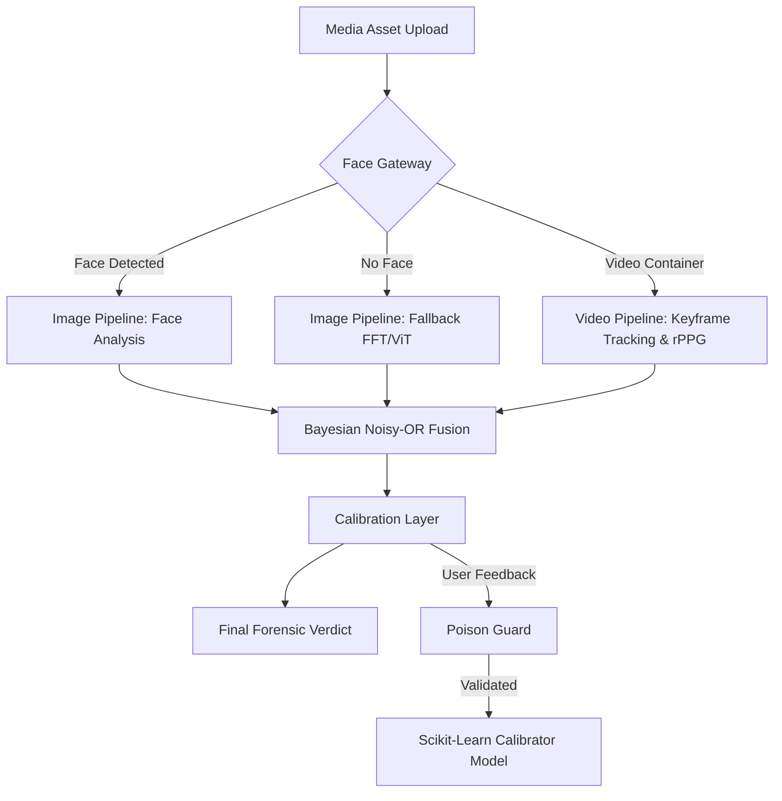

# Axiom-I: Physics-Guided Deepfake Image and Video Forensics Platform

[](LICENSE)
[](https://www.python.org)
[](https://nextjs.org)
[](https://fastapi.tiangolo.com)
[](https://github.com/Adarsh-61/Axiom-I)

Welcome to Axiom-I, a complete, professional, and explainable media forensics platform designed for deepfake detection, synthetic image inspection, and video manipulation analysis. By combining physics-informed computer vision algorithms, physiological pulse extraction, temporal anomaly analysis, and probabilistic fusion, Axiom-I offers a robust and local-first solution for media verification.

Official project links:
* GitHub Repository: https://github.com/Adarsh-61/Axiom-I
* Frontend: https://axiom-i.vercel.app/
* Alternative Domain: https://axiom.dpdns.org/
* Backend Space: https://huggingface.co/spaces/Adarsh-61/axiom-backend

---

## Project Overview

Generative AI models and deepfake software have progressed to a point where synthetic media can easily bypass human observation. Traditional deep learning approaches to detection are often treated as black boxes and are prone to overfitting on dataset-specific compression profiles. Axiom-I addresses these issues by grounding its forensic analysis in physical constraints (such as 3D illumination consistency) and biological markers (such as remote photoplethysmography). The system operates on a client-server microservices model, designed to process media locally to preserve user data privacy.

---

## Key Features

* **Bifurcated Image Pipeline**: Supports full physics-based face analysis and a fallback analysis path for images without faces.
* **Temporal Video Pipeline**: Ingests video containers, samples keyframes adaptively, and extracts temporal anomalies across frames.
* **3D Illumination Consistency**: Computes 3D surface normals and fits a 9-term spherical harmonics basis to detect lighting discrepancies.
* **Specular Residual Homology**: Extracts specular highlights using Lambertian subtraction and calculates topological complexity.
* **Remote Photoplethysmography (rPPG)**: Extracts cardiac pulse waves from facial skin regions to verify physiological presence.
* **Probabilistic Bayesian Fusion**: Fuses multiple independent anomaly scores using a Noisy-OR Bayesian network.
* **Feedback and Online Calibration**: Blends physics-guided heuristic scores with a learned classifier model using user-submitted feedback.
* **Anti-Tampering Poison Guard**: Evaluates incoming telemetry feedback against seed distributions to block adversarial data poisoning.

---

## System Architecture

Axiom-I is structured as a decoupled microservices architecture comprising two primary components:
1. **Frontend Presentation Layer**: A Next.js web application built with TypeScript and Vanilla CSS. It provides a visual media upload interface, a pipeline visualization graph showing step-by-step calculations, and a mathematics page using KaTeX rendering.
2. **Backend Forensic Engine**: A FastAPI Python service that runs OpenCV, NumPy, PyWavelets, and PyTorch for feature extraction and model inference.

Below is the high-level system components diagram representing the ingestion flow, the bifurcated core pipelines, the calibration layer, and deployment details.



### Image Pipeline
The image processing pipeline uses physical constraints and signal signatures:
* **Specular Residual Homology**: Extracts specular highlights using Lambertian subtraction and computes topological complexity.
* **3D Illumination Consistency**: Fits a 9-term Spherical Harmonics basis to detect lighting direction discrepancies across facial region normals.
* **Patch PRNU Consistency**: Measures local sensor pattern noise variation to identify composite patch manipulations.
* **Frequency and Texture Analysis**: Computes Fast Fourier Transform (FFT) HFER ratios and Discrete Wavelet Transform (DWT) energy maps.
* **Vision Transformer Classifier**: Fallback deep network classifier for semantic verification.

### Video Pipeline
The video forensics pipeline analyzes temporal variations across sequences:
* **Remote Photoplethysmography (rPPG)**: Extracts cardiac pulse waves from facial skin regions to verify biological presence.
* **Illumination Drift**: Solves for spherical harmonics parameters per frame to track continuous lighting changes over time.
* **Temporal Flicker & Wavelets**: Checks pixel fluctuation rates and high-frequency wavelets across the temporal axis.
* **Global Flow & Compression Residuals**: Measures optical flow divergence and compression anomalies across video codecs.

### Calibration Layer
The calibration layer acts as a post-processing step to adjust the heuristic score. It matches the physics-guided score with a learned model fit on user feedback. The learned model receives zero weight until a trust threshold of 15 verified feedback submissions is reached. To prevent adversarial model poisoning, the Poison Guard validation checks reject feedback that conflicts significantly with the physics-based features.

### Deployment Architecture
The platform is designed to run in containerized or serverless hosting environments with minimal setup:

```
[Frontend Client]         [Backend Engine]
   (Next.js)                (FastAPI)
       |                        |
   Deployed to              Deployed to
    (Vercel)            (Hugging Face Space)
       |                        |
       v                        v
https://axiom-i.vercel.app  https://huggingface.co/.../axiom-backend
       |                        |
       +------- API Requests ---+
                                |
                            Storage:
                         Local / HF Dataset
```
* **Frontend**: Hosted on Vercel at `https://axiom-i.vercel.app/` (with custom domain fallback `https://axiom.dpdns.org/`).
* **Backend**: Hosted on Hugging Face Spaces at `https://huggingface.co/spaces/Adarsh-61/axiom-backend`.
* **Data Storage**: Stores telemetry feedback database files locally when in local development or commits them directly to Hugging Face Dataset space when running on public staging.

---

## Technology Stack

### Backend
* **Framework**: FastAPI, Uvicorn
* **Numerical Processing**: NumPy, SciPy
* **Computer Vision**: OpenCV (headless)
* **Signal Processing**: PyWavelets (discrete wavelet transforms)
* **Deep Learning**: PyTorch, Transformers (Hugging Face Hub)
* **Machine Learning**: Scikit-Learn (calibrator classifiers)
* **Rate Limiting**: Slowapi

### Frontend
* **Framework**: Next.js (App Router), React
* **Language**: TypeScript
* **Styling**: Vanilla CSS
* **Math Rendering**: KaTeX

---

## Folder Structure

```
Axiom-I/
  Coding/
    backend/
      app/
        api/
          routes.py          - Image analysis and health endpoints
          video_api.py       - Video analysis and video feedback endpoints
          feedback.py        - Diagnostics and feedback metrics
          schemas.py         - Pydantic models for API serialization
        ml/
          pipeline.py        - Main image analysis pipeline orchestrator
          video_pipeline.py  - Main video analysis pipeline orchestrator
          video_ingest.py    - Frame sampling and quality checks
          face_detector.py   - MTCNN face detection wrapper
          face_tracker.py    - Face tracking across video sequences
          face_alignment.py  - Depth map and normal estimation
          retinex.py         - Multi-scale Retinex texture extraction
          illumination.py    - Spherical harmonics lighting solver
          specular.py        - Lambertian renderer and specular extraction
          sri_net.py         - Specular anomaly scores and image fusion
          video_sri_net.py   - Video signal fusion weights
          frequency.py       - 2D Fast Fourier Transform (FFT)
          patch_analysis.py  - Local PRNU noise variance
          topology.py        - Topological complexity metrics
          wavelet.py         - Discrete wavelet transform
          vit_classifier.py  - Pre-trained Vision Transformer wrapper
          evolution.py       - Image calibration database and models
          video_evolution.py - Video calibration database and models
          rppg_signal.py     - Blood volume pulse extraction
          temporal_backbone.py - 3D model feature extraction
          temporal_fft.py    - Temporal pixel flickering analysis
          temporal_lighting.py - SH lighting drift metrics
          wavelet_temporal.py - Temporal HH sub-band variance
          fullframe_temporal.py - Global scene flow divergence
          compression_residual.py - Forensic compression noise tracking
        security/
          middleware.py      - HTTP security headers
          rate_limiter.py    - Slowapi rate limit configurations
      deploy_hf.py           - Deployment script for Hugging Face Spaces
      Dockerfile             - Backend container setup file
      requirements.txt       - Python dependency configuration
    frontend/
      src/app/
        page.tsx             - Main forensic analysis workspace
        math/page.tsx        - Step-by-step mathematical proofs page
        globals.css          - Custom style rules
        helpers.ts           - Interface declarations and API utilities
        Tex.tsx              - KaTeX rendering component
  Documents/
    Diagrams/                - Flowcharts and architectural block diagrams
    Axiom-I.odp              - Project presentation slide file
```

---

## Installation

### Prerequisites
* Python 3.11 or higher
* Node.js 20 or higher
* uv (recommended Python package installer) or pip
* npm

### Step 1: Clone the repository
```bash
git clone https://github.com/Adarsh-61/Axiom-I.git
cd Axiom-I
```

### Step 2: Set up the Python virtual environment
```bash
uv venv .venv
source .venv/bin/activate
```
On Windows PowerShell:
```powershell
uv venv .venv
.venv\Scripts\Activate.ps1
```

### Step 3: Install backend dependencies
```bash
uv pip install -r Coding/backend/requirements.txt
```

### Step 4: Install frontend dependencies
```bash
cd Coding/frontend
npm install
cd ../..
```

### Step 5: Configure environment files
```bash
cp Coding/backend/.env.example Coding/backend/.env
```

---

## Local Development

Open two separate terminals to run the frontend and backend microservices.

### Terminal 1: Backend Server
```bash
source .venv/bin/activate
cd Coding/backend
uvicorn app.main:app --reload --host 127.0.0.1 --port 8000
```

### Terminal 2: Frontend Client
```bash
cd Coding/frontend
npm run dev
```

The system will be accessible at:
* Frontend interface: http://localhost:3000
* Backend documentation: http://localhost:8000/docs
* Backend health check: http://localhost:8000/api/v1/health

---

## Environment Variables

### Backend Configuration (`Coding/backend/.env`)
Edit this file to configure the backend runtime variables:
* `AXIOM_DEVICE`: Hardware target for PyTorch, cpu or cuda.
* `AXIOM_DEBUG`: Set to true to print stack traces and debug logs.
* `AXIOM_API_HOST`: Binding host for the FastAPI server.
* `AXIOM_API_PORT`: Binding port for the FastAPI server.
* `AXIOM_ALLOWED_ORIGINS`: JSON list of allowed origins for CORS.
* `AXIOM_ALLOW_MODEL_DOWNLOAD`: Set to true to download ViT weights on startup.
* `AXIOM_VIT_MODEL_NAME`: Hugging Face path for the image classifier.
* `AXIOM_MODE`: Storage destination, local or host.
* `AXIOM_HF_TOKEN`: Access token for private dataset syncing.
* `AXIOM_HF_DATASET_PATH`: Remote repository target on Hugging Face.

### Frontend Configuration (`Coding/frontend/.env.local`)
Create or edit this file to configure the backend API base endpoint URL:
```env
# Local Development
NEXT_PUBLIC_API_BASE=http://localhost:8000

# Hosted Backend Production
NEXT_PUBLIC_API_BASE=https://huggingface.co/spaces/Adarsh-61/axiom-backend
```

## API Endpoints

The backend routes are grouped under `/api/v1`:

### Ingestion & Analysis
* `POST /api/v1/analyze`: Analyzes an uploaded image file (multipart/form-data) using the image forensics pipeline.
* `POST /api/v1/analyze/video`: Analyzes an uploaded video file (mp4, webm, mov, avi) using the temporal forensics pipeline.

### Telemetry & Feedback
* `POST /api/v1/feedback`: Submits ground-truth label feedback for a previously analyzed image.
* `POST /api/v1/feedback/video`: Submits ground-truth label feedback for a analyzed video.
* `GET /api/v1/feedback/metrics`: Returns aggregated metrics, including the confusion matrix, Brier scores, and calibration logs.

### System Diagnostics
* `GET /api/v1/health`: Checks dependencies and checks model cache states.

---

## Mathematical Foundations

Axiom-I represents its findings through step-by-step mathematical proofs:

### 1. Specular Cross-Correlation
Measures how closely the specular residual highlights match the skin texture map. High cross-correlation indicates fake, synthetic highlight generation:
```
NCC = corr(texture, specular)
Score_specular = 1 / (1 + exp(-15 * (NCC - 0.30)))
```

### 2. Frequency Domain Log-Ratio
Generative networks leave repeating grids that skew high-frequency spectra. The ratio compares high-frequency energy (HFE) to low-frequency energy (LFE):
```
HFER = HFE / LFE
Score_frequency = 1 / (1 + exp(-3.0 * (log10(HFER) + 4.5)))
```

### 3. Patch Noise Consistency
Measures the consistency of camera sensor noise (PRNU) across a 4x4 grid of image patches. Real cameras have uniform noise distributions; fakes show structural fluctuations:
```
CV = std(SNR_patches) / mean(SNR_patches)
Score_patch = 1 / (1 + exp(-20 * (CV - 0.25)))
```

### 4. Bayesian Noisy-OR Fusion
Calculates the final heuristic anomaly probability by modeling each signal as an independent cause of a detection alert:
```
P(Real) = prod(1 - w_i * s_i)
P(Ensemble) = 1 - P(Real)
Heuristic = 1 / (1 + exp(-8 * (P(Ensemble) - 0.40)))
```
Weights: Specular = 0.10, Frequency = 0.18, Topology = 0.22, Patch = 0.22, Wavelet = 0.15, ViT = 0.13.

---

## Deployment Guide

### Backend: Hugging Face Spaces (Docker SDK)
The backend is prepared for containerized hosting. The script `deploy_hf.py` automates the process:
1. Ensure the `huggingface_hub` package is installed.
2. Run the deployment script:
   ```bash
   python Coding/backend/deploy_hf.py
   ```
3. Enter your Hugging Face Write Token when prompted. The script will create a private dataset for telemetry logging, set container secrets, and upload the codebase.

### Frontend: Vercel
The frontend web application can be deployed to Vercel:
1. Connect your GitHub repository to Vercel.
2. Set the build parameters:
   * Build Command: `npm run build`
   * Output Directory: `.next`
   * Install Command: `npm install`
3. Add the Environment Variable `NEXT_PUBLIC_API_BASE` pointing to your running backend space API.

---

## Security Notes

* **Security Headers**: Custom middleware enforces strict Content Security Policy (CSP), anti-clickjacking (X-Frame-Options), and MIME-sniffing protections.
* **Client Isolation**: To support Hugging Face iframe widgets, CSP headers dynamically adjust depending on the domain to allow embed rendering.
* **Telemetry Protection**: The Poison Guard validation ensures that the calibration model cannot be compromised via malicious feedback injection.

---

## Performance Notes

* **Adaptive Sampling**: Videos are capped at 30 keyframes to prevent high resource usage.
* **Lazy Module Imports**: Heavy packages like PyTorch and transformers are imported lazily, reducing the backend initial startup time.
* **LRU Caching**: Radial geometry calculation grids are cached using Python's `lru_cache` to speed up FFT math.

---

## Contributing

We welcome contributions to Axiom-I. Please follow the instructions below to help improve the platform.

### How to Contribute
1. Fork the repository and create a feature branch (e.g., `feature/improved-rppg`).
2. Write clean Python code conforming to PEP 8 standards, and ensure TypeScript files pass linting (`npm run lint`).
3. Submit a pull request detailing the changes and verification results.

### Reporting Issues
Please report bugs or errors on our GitHub issue tracker. When reporting issues, please include:
* Operating system environment specifications
* Standard reproduction steps
* Relevant logs and terminal tracebacks

### Feature Requests
To suggest new features, core algorithms, or enhancements, please open an issue with the `enhancement` label. Describe the proposed implementation, mathematical grounding, and expected performance impact.

### Code of Conduct
Contributors are expected to maintain a professional, respectful, and constructive environment. Academic integrity guidelines must be followed at all times.

---

## Citation

### How to Cite
If you use Axiom-I or refer to its physical/physiological media forensic pipelines in your academic work or thesis, please use the following citation format:

```bibtex
@misc{axiom2026,
  author       = {Adarsh Pandey},
  title        = {Axiom-I: Physics-Guided Deepfake Image and Video Forensics Platform},
  year         = {2026},
  publisher    = {GitHub},
  journal      = {GitHub Repository},
  howpublished = {\url{https://github.com/Adarsh-61/Axiom-I}}
}
```

### Research Use
Axiom-I is developed as part of an MSc thesis focusing on explainable media forensics. Researchers are encouraged to build on the physical and physiological signals (such as remote PPG and specular residuals) to advance trust in digital media detection.

### Academic Use
Permission is granted to use this platform for academic teaching, research demonstrations, and benchmarking. For commercial integration or derivative products, please contact the author.

---

## Known Limitations

* **rPPG Neck ROI**: Face cropping padding (10%) restricts the neck area inside the cropped bounding box. Thus, the bottom section of the crop often reads the jawline or collar rather than the neck.
* **Untrained VideoMamba-Proxy**: The temporal backbone model uses an untrained proxy CNN architecture. Its Noisy-OR fusion weight is disabled (0.00) pending model training.

---

## License

This project is licensed under the MIT License. See the [LICENSE](LICENSE) file for details.

---

## Acknowledgements

* **facenet-pytorch**: For the MTCNN face detection implementation.
* **Hugging Face**: For model hosting and Space container environments.
* **Vercel**: For frontend web hosting.

---

## Contact Information

* Project Lead: Adarsh Pandey
* GitHub Profile: https://github.com/Adarsh-61
* GitHub Repository: https://github.com/Adarsh-61/Axiom-I
